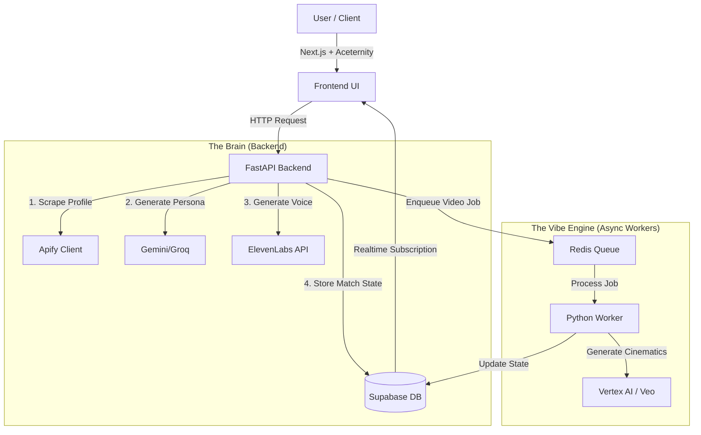

# Product Requirement Document (PRD): Koyak Kombat
**Version:** 1.0 (Hackathon MVP)
**Status:** Approved for Development

## 1. Executive Summary
Koyak Kombat is a generative AI "Roast Arcade" where social media profiles are scraped to create "Digital Twin" fighters. These avatars engage in autonomous, voice-enabled verbal warfare in a retro Street Fighter-style environment that evolves visually based on emotional damage.

**Core Value Prop:** Watching two specific personas (e.g., Elon vs. Zuck) roast each other with hyper-specific context, culminating in user-directed, AI-generated cinematic fatalities.

## 2. Technical Stack Strategy
**Rationale:** We are prioritizing visual "wow" factor (Frontend) and stability (Backend).

### Frontend (The Arcade Console)
*   **Framework:** Next.js (JavaScript, Pages Router). No TypeScript to speed up hackathon velocity.
*   **Styling:** Tailwind CSS.
*   **Component Libraries:**
    *   **Shadcn UI:** For forms, modals, inputs (clean structure).
    *   **Aceternity UI / MagicUI:** For the "Cyberpunk/Arcade" aesthetic (glow effects, animated borders, hero sections).
    *   **ReactBits:** For micro-interactions (particles, health bars).
*   **Canvas:** tldraw (Embedded for the Fatality sketching phase).

### Backend (The Game Engine)
*   **Language:** Python 3.10+ (Chosen for native support of Vertex AI, Apify, and LLM SDKs).
*   **Framework:** FastAPI. (High performance, easy async handling for long-running AI tasks).
*   **Database:** Supabase (PostgreSQL). Handles User Auth and Game State.
*   **Job Queue:** Redis. (CRITICAL: Video generation is slow; we must offload it from the main thread).

### AI Services (The Brains)
*   **Scraping:** Apify (Actors: apidojo/tweet-scraper & apify/instagram-scraper).
*   **LLMs (Logic):** Gemini 1.5 Pro (Context window allows for massive scraped data analysis) or Groq (Llama 3) for speed.
*   **Voice:** ElevenLabs (Voice Design & Presets).
*   **Video/Visuals:** Google Vertex AI (Veo/Imagen) - Leveraging FlowBoard logic.

## 3. System Architecture Diagram
This data flow ensures the UI remains responsive while heavy AI tasks process in the background.

## 4. Key Feature Specifications

### 4.1. The "Digital Twin" Spawner (Onboarding)
*   **User Flow:** User pastes URL -> System scrapes -> User selects Voice -> "FIGHT".
*   **Frontend:**
    *   Input field using Shadcn Input with MagicUI glowing border.
    *   "Voice Selector" Dropdown:
        *   Option A: Preset (List of ~5 distinct ElevenLabs voices).
        *   Option B: "Vibe Match" (Auto-generated via Voice Design).
*   **Backend Logic:**
    *   Call Apify to get last 50 posts.
    *   Pass posts to Gemini: "Summarize this person's deepest insecurities, writing style, and 3 specific embarrassing facts."
    *   Save result as `system_prompt` in Supabase.

### 4.2. The Battle Interface (Core Gameplay)
*   **Visuals:** Retro fighting game layout. Left Portrait vs. Right Portrait.
*   **Logic:** Turn-based.
    *   **Fighter A Turn:**
        *   Send conversation history to LLM -> Get Roast Text.
        *   Send Text to ElevenLabs -> Get Audio.
        *   Frontend plays Audio + animates avatar (simple CSS bounce or GIF loop).
    *   **Judge AI (Hidden):**
        *   Analyze Roast Text (0-100 damage score).
        *   Update Health Bar (Aceternity UI animated bar).
        *   Trigger: If Damage > 80, emit "CRITICAL_HIT" event.

### 4.3. The Vibe Engine (Dynamic Environments)
*   **Concept:** The background video changes based on game state.
*   **Implementation:**
    *   **State 0 (Start):** Loop `peaceful_dojo.mp4` (Pre-generated).
    *   **State 1 (Critical Hit):** Worker generates `dojo_burning.mp4` using Vertex AI (Image-to-Video).
    *   **Frontend:** Uses a smooth CSS fade to swap the background video source when the Supabase state changes.

### 4.4. The "FlowFinish" Fatality (Victory Screen)
*   **Concept:** Winner draws how they want to kill the loser.
*   **Frontend:**
    *   Overlay tldraw canvas (Whiteboard).
    *   User sketches stick figure -> Clicks "EXECUTE".
*   **Backend (The FlowBoard Integration):**
    *   Receive Sketch (SVG/PNG) + Prompt ("Throwing him into the sun").
    *   Call Vertex AI (Veo/Imagen).
    *   Generate 3s video.
    *   Stream back to Frontend.

## 5. API Endpoints (FastAPI)

| Method | Endpoint | Description |
| :--- | :--- | :--- |
| POST | `/api/v1/fighters/create` | Inputs: URL, Voice Choice. Outputs: fighter_id, summary. |
| POST | `/api/v1/match/start` | Inputs: fighter_1_id, fighter_2_id. Creates Match in DB. |
| POST | `/api/v1/match/turn` | Inputs: match_id. Triggers LLM roast + ElevenLabs. Returns Audio URL. |
| POST | `/api/v1/fatality/generate` | Inputs: sketch_image, text_prompt. Triggers background video generation. |
| GET | `/api/v1/match/{id}/highlight` | Returns stitched video URL of top 3 roasts. |

## 6. Database Schema (Supabase)

**Table: fighters**
*   `id` (uuid)
*   `name` (string)
*   `source_url` (string)
*   `system_prompt` (text) - The injected personality
*   `voice_id` (string) - ElevenLabs ID

**Table: matches**
*   `id` (uuid)
*   `fighter_1_id` (ref)
*   `fighter_2_id` (ref)
*   `history` (jsonb) - Full chat log
*   `background_state` (string) - 'neutral', 'burning', 'hell'

## 7. Implementation Roadmap (Hackathon Timeline)

### Phase 1 (The Skeleton)
*   Setup Next.js + FastAPI.
*   Hardcode 2 fighters (e.g., Elon vs Zuck) manually.
*   Get the Chat -> Voice loop working (Text appears, Audio plays).

### Phase 2 (The Data)
*   Connect Apify.
*   Implement "Create Fighter" flow.

### Phase 3 (The Vibe)
*   Implement the "Health Bar" and "Judge AI".
*   Connect Vertex AI for the Fatality generation (FlowBoard logic).

### Phase 4 (Polish)
*   Apply Aceternity/MagicUI effects.
*   Create the "Highlight Reel" stitcher.

## 8. Engineer Notes
*   **Latency:** ElevenLabs takes ~1-2s. LLM takes ~1-2s. Use a "Thinking..." animation (perhaps a bouncing pixel art character) to mask this loading time.
*   **Rate Limits:** Be careful with Apify and Vertex AI quotas. Cache the results of famous people so we don't re-scrape them during testing.
*   **Video Gen:** Video generation is the slowest part. The "Fatality" is the only time the user should explicitly wait for video. Background swaps should happen asynchronously (don't pause the game for them).
